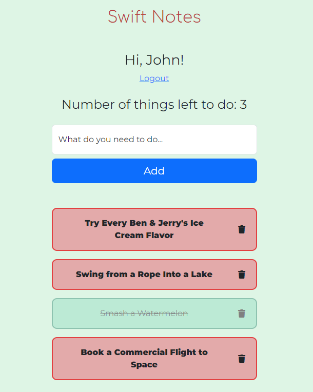

# Swift Notes
Login and create your own notes through an input. Mark them as complete by clicking on them or delete them by clicking the trash can icon.

## Tech Used
HTML, CSS, JavaScript, Pug, Bootstrap, Node, MongoDB, Git, MVC architecture

## Things to add
Create a `.env` file in config folder and add the following as `key = value`.
 
 * PORT = 8000
 * DB_CONNECTION_STRING = `your database URI`

## How to run application
### Install dependencies
`npm install`

### Run
`npm run dev`

## Screenshots
